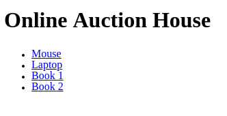
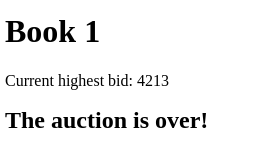
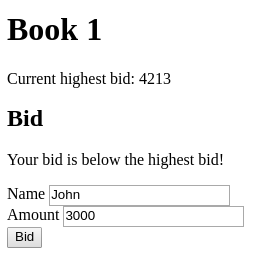

# Rueppellii Orientation Retake Exam
We are going to create a web-based auction application.

**Read the whole description in order to understand the application.**

- Feel free to add auction items to the database
- We expect that there is always at least auction item in the database
  and all auction item got at least one bid

## `GET /`
- The main page should be rendered
- It must contain a list of all auctions (even the expired ones)
- Each auction must be linked to the bidding page (`GET /{id}`)

### Main Page


## `GET /{id}`
- The bidding page should be rendered with the specific auction
- The current highest bid should be displayed
- If the auction is over do not display the form to bid
- Else display a form with two input fields and a submit button
- The form should be submitted to `POST /bid/{id}`

### The bidding page has 3 scenarios

#### Default


#### Over


#### Message


## `POST /{id}`
- If the bid is less than or equal to the highest bid redirect to the
  `GET /{id}` endpoint using the message scenario with the message
  "Your bid is below the highest bid!"
  - Do not clear the input fields
- If the auction is over redirect to `GET /{id}` endpoint using the over
  scenario
- Else it should change the highest bid to the received amount and redirect to
  the `GET /{id}` endpoint using the default scenario

## `GET /api/items`
- It should respond with the stored auction items in the following JSON format
- The `expiryDate`'s format might be different but must include the year, month,
  day, hour and minute
```json
[
  {
    "id": 3,
    "title": "Book 2",
    "expiryDate": "2018-03-04T23:12:123",
    "bids": [
      {
        "name": "John",
        "amount": 21344
      },
      {
        "name": "Jane",
        "amount": 321
      },
      {
        "name": "Doe",
        "amount": 73
      }
    ]
  }
]
```

## Question
Which statement would you use to to obtain information about table structure?
