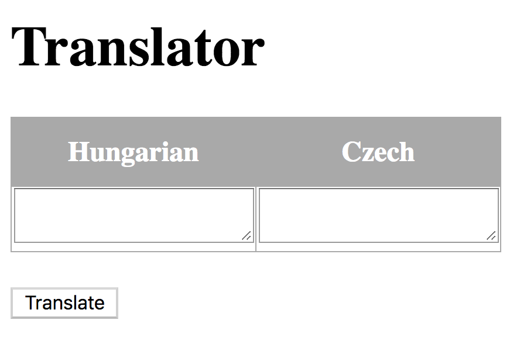
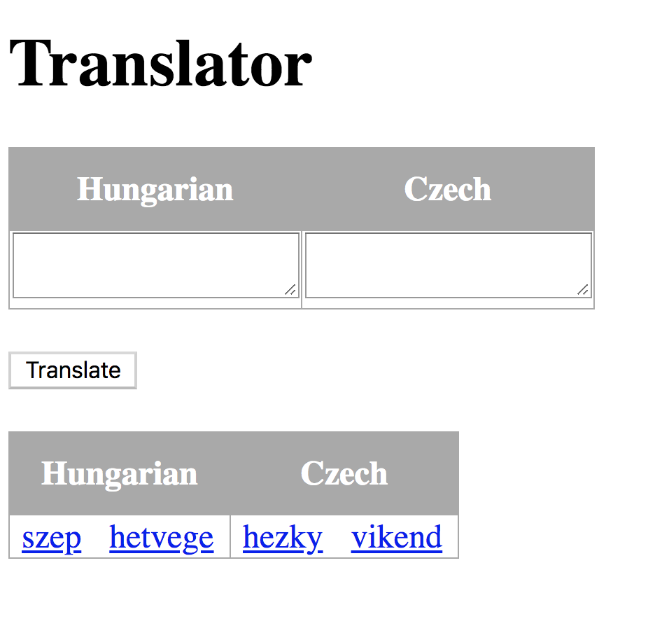
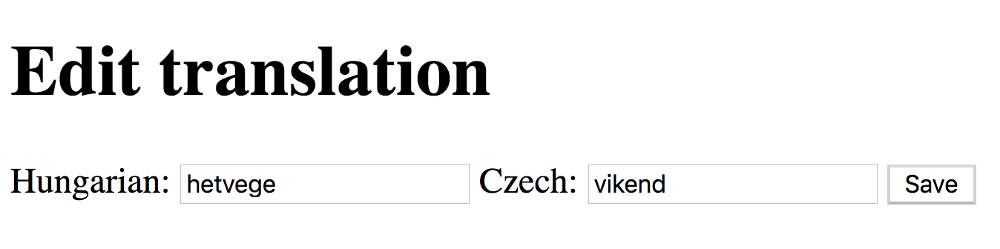

# Another Orientation Exam

## Tourist Information

Build a web application similar to Google Translate for translating words that are in the database.

## Endpoints

Create the following endpoints:

### `GET /`

The main page is rendered:


- a form is displayed to get input for what to translate
  - textarea for multiple words in both languages
  - a button for sending the data

### `POST /`

- it should find all words submitted into one of the textareas
- if both textarea was filled you can ignore one of them
- it should count how many times the words were searched for in the database

The main page is rendered with the translation:



- the translated words should be links to editing the word's translation

### `GET /suggest/{id}`

- it should render the edit page for translation
- with a form prefilled with data of the words
- the form should be sent to `POST /suggest/{id}`



### `POST /suggest/{id}`
- it should save the edited translation

### `GET /api/frequent`
- it should respond with the 4 most frequently searched word in the following `JSON` format:
```json
[
  {
    "id": 7,
    "hungarian": "szep",
    "czech": "hezky",
    "count": 123
  },
  {
    "id": 8,
    "hungarian": "hetvege",
    "czech": "vikend",
    "count": 111
  },
  {
    "id": 1,
    "hungarian": "korte",
    "czech": "hruska",
    "count": 98
  },
  {
    "id": 4,
    "hungarian": "haz",
    "czech": "dum",
    "count": 81
  }
]
```

## 2) Question time
 -  Write a wrapper `Java` class for the following `JSON` object:
```json
{
  "user": {
    "id": 1,
    "name": "aze",
    "email": "aze@greenfox.academy"
  },
  "messages": [
    {
      "sender": "tojas",
      "text": "have you done the materials?"
    },
    {
      "sender": "levi",
      "text": "can you come to the meeting?"
    }
  ],
  "messages_count": 2
}
```
